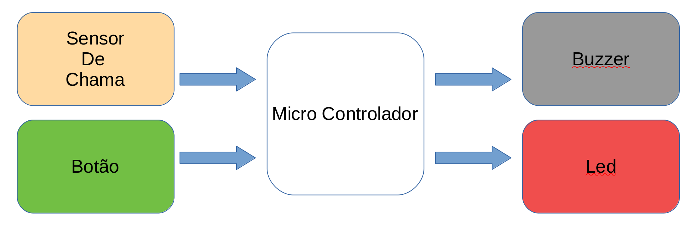
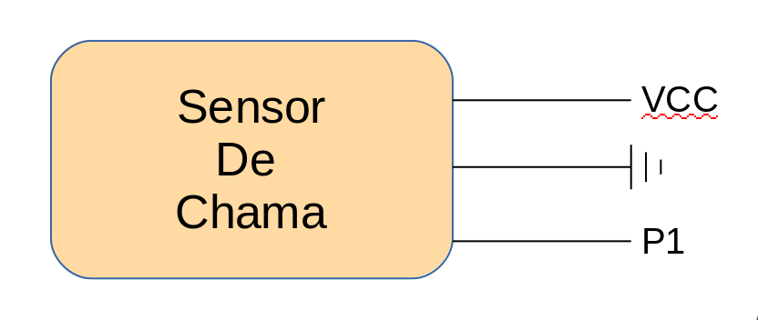
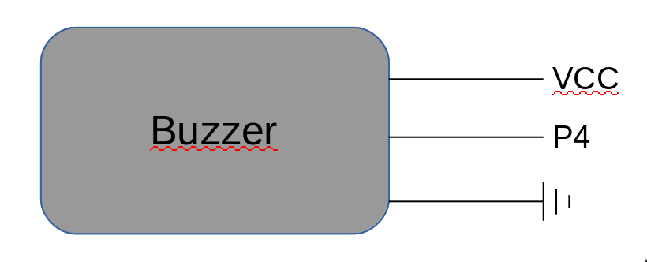

# Trabalho de Computação Embarcada
Eduardo Tirta e Guilherme Graicer

## Screaming Charmander
### Descrição do Projeto
O projeto consiste em um alarme para incêndio que irá piscar um led e soar um buzzer para que as pessoas saiam do local, e não corram risco de ficar em um prédio em chamas. O alarme e o led, só serão desligados após um botão ser apertado, indicando segurança.

### Materiais utilizados
|**Sensores**|**Atuadores**|
| --------   | ---------   |
|Sensor de Chama|  Led   |
|    Botão      | Buzzer |

### Diagrama

Sensor de chama

Botão

Buzzer

Led

